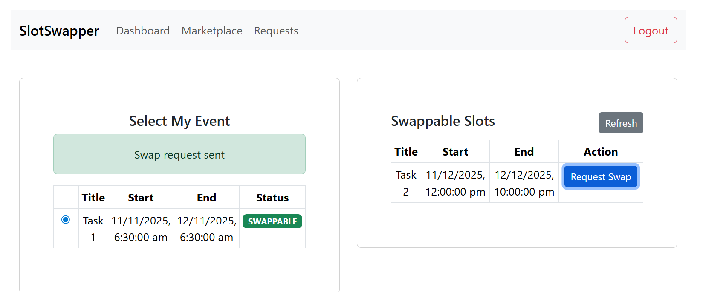
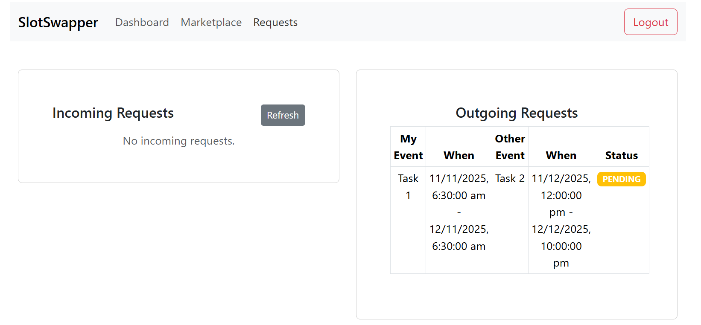
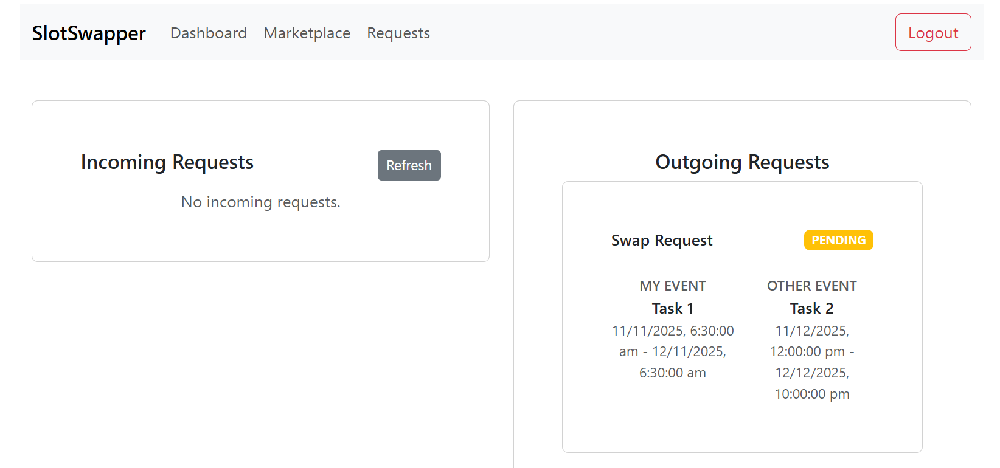
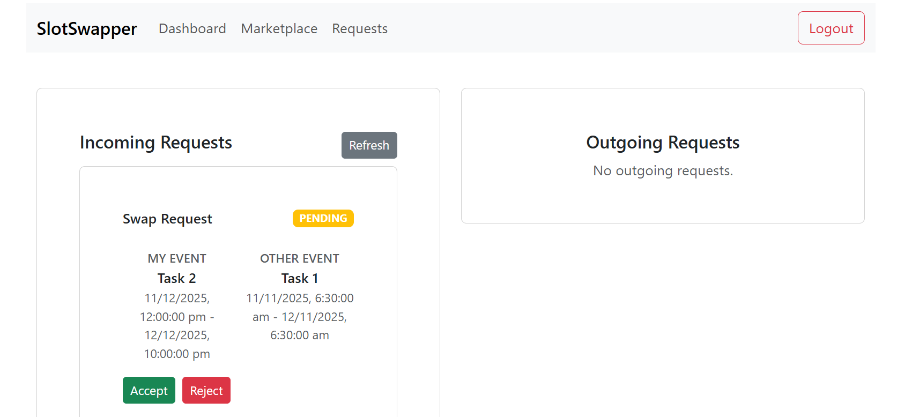
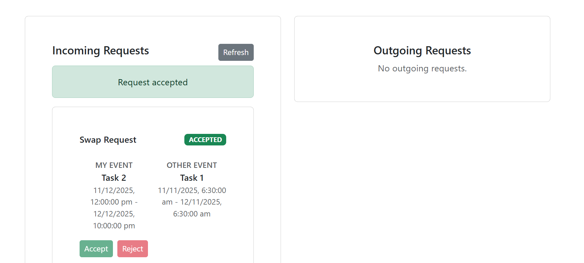

# SlotSwapper – A Peer‑to‑Peer Time‑Slot Swapping App

A clean, beginner‑friendly MERN (MongoDB, Express, React, Node.js) app. Functional React with hooks and Bootstrap styling. JWT auth, simple Express routes, and basic Mongoose models.

## 📸 Preview

[](https://github.com/Rahul-49/SlotSwapper)
[](https://github.com/Rahul-49/SlotSwapper)
[](https://github.com/Rahul-49/SlotSwapper)
[](https://github.com/Rahul-49/SlotSwapper)
[](https://github.com/Rahul-49/SlotSwapper)


## Quick Start

Prerequisites:
- Node 18+
- Local MongoDB running at mongodb://127.0.0.1:27017

Install and run (from project root):
```
- Backend: http://localhost:5000
- Frontend: http://localhost:5173

## Run Servers Step by Step

### Backend (API)

From the project root (`e:\SDE`):

```powershell
cd backend
npm install
cd src
nodemon server
```

Environment file (already created): `backend/.env`

```
PORT=5000
MONGO_URI=mongodb://127.0.0.1:27017/slotswapper
JWT_SECRET=change_me
```

Make sure your local MongoDB service is running.

### Frontend (React)

From the project root (`e:\SDE`):

```powershell
cd frontend
npm install
npm run dev
```

The app will be available at `http://localhost:5173`.

## Backend
Location: `backend/`

Environment: `backend/.env`
```
PORT=5000
MONGO_URI=mongodb://127.0.0.1:27017/slotswapper
JWT_SECRET=change_me
```

Scripts:
- `npm --prefix backend run dev` – start API with nodemon

Tech:
- Express 5, Mongoose 8, JWT, bcrypt, CORS, dotenv

Models:
- User: `{ name, email, password }`
- Event: `{ title, startTime, endTime, status: BUSY|SWAPPABLE|SWAP_PENDING, userId }`
- SwapRequest: `{ requesterUserId, requestedUserId, requesterEventId, requestedEventId, status: PENDING|ACCEPTED|REJECTED }`

Middlewares:
- `auth` – reads Bearer token and attaches `req.user.id`

Routes:
- `POST /api/auth/signup` – `{ name, email, password }`
- `POST /api/auth/login` – `{ email, password }`
- `GET /api/events` – list own events (auth)
- `POST /api/events` – create event (auth)
- `PUT /api/events/:id` – update own event (auth)
- `DELETE /api/events/:id` – delete own event (auth)
- `GET /api/swappable-slots` – other users’ SWAPPABLE events (auth)
- `POST /api/swap-request` – `{ requesterEventId, requestedEventId }` (auth)
- `POST /api/swap-response/:id` – `{ action: 'accept'|'reject' }` (auth)
- `GET /api/swap-requests` – `{ incoming, outgoing }` (auth)

Swap Accept semantics:
- Exchanges `userId` between the two events and sets both `status=BUSY` in a transaction
- Marks the accepted request as `ACCEPTED` and rejects other PENDING requests involving those events

## Frontend
Location: `frontend/`

Scripts:
- From the `frontend/` directory: `npm run dev` – start Vite dev server

Tech:
- React 19 (functional), React Router, Axios
- Bootstrap 5 + React‑Bootstrap

Structure:
- `src/api/client.js` – axios client with Bearer token from localStorage
- `src/context/AuthContext.jsx` – login/signup/logout, token + user state
- `src/routes/ProtectedRoute.jsx` – guards protected pages
- Pages: Login, Signup, Dashboard (CRUD own events), Marketplace (swappable + send swap), Requests (incoming/outgoing accept/reject)

Notes:
- After login/signup, JWT is stored in `localStorage` as `token`
- All protected requests send `Authorization: Bearer <token>` automatically
